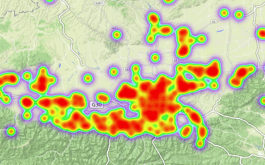

# 基本概念
ElasticSearch是一个基于Lucene的搜索服务器。它提供了一个分布式多用户能力的全文搜索引擎，基于RESTful web接口。-baidu百科

!> 上面的说明都是一些说明性质的语言,针对我们的地图开发没有任何帮助.

>针对地图开始,els前端地图开发主要关注的是`可视域内`的动态矢量数据请求并`绘制`.

**以下面的某个时间片段的聚类热力图为例**

该开发流程一共分为三步:
1. 准备els请求的参数
  + 获取当前浏览器地图窗口的范围 extent [top_left, bottom_right]
  + 获取当前请求时间段的数据[startTime, endTime],也可以是某个时间节点的数据 startTime = endTime
  + 获取当前地图显示的级别,一般是1-20级以内 `els`支持 `1~12级的`数据精度,因此需要注意不要超过`12级`
2. 发送els网络请求 `核心步骤` 
  + **loadElsService(extent, precision, start, end);** 这四个参数来自于上面的准备参数
    - 中地接口 直接采取`post请求`传递这四个参数即可
    - 标准els官方示例,要实现上面的参数相对复杂需要掌握官方的`DLS嵌套规则`才能传递参数
3. 获取返回数据并显示
  + 获取返回的els标准的数据(这里是类似下面的格式)
  + `转换`els标准的数据为geojson或者对应前端引擎leaflet等规定的数据格式(这里是转换成点数组)
  + 通过各种前端渲染引擎的渲染api渲染各自的图形(这里是heaterlayer渲染点数据,使用的是[热力图](/leaflet/dataview/heater))热力图

# 前端js接口
ElasticSearch的前端调用方式有两种,一种是官方的els的调用脚本,第二种是中地封装的接口.

## 官方接口 **复杂-高效高拓展性**

!> 虽然该脚本库是调用的els的服务,但是如果不知道els的语法与概念是很难理解该官方的脚本库调用的.

## 中地接口 **简洁-低拓展性**

中地封装的接口是通过DataStore来实现的.该接口主要的是将elasticsearch的复杂的查询语法在后台实现,前端只需针对传递几个特殊的参数即可,这种方式的特点是简单,但是`简单的同时失去了拓展性`,只能针对`特定的常见的业务`进行封装.如空间范围内聚类,轨迹跟踪等.一旦前端的业务需求和后台封装的不一样就只能通过告诉后台研发人员进行`新的功能封装`.
