# 产品线成果报告

---
## 官方示例
> 官方示例相对简单主要是基本的地图操作，如加载地图、地图控制、地图标记、地图交互等

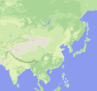  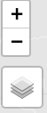 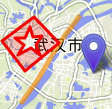 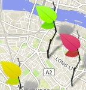 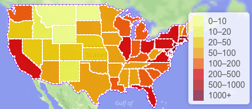

---
## 基本使用
> 基本使用现在只实现了地图控件和地图标注

### 地图控件
- [x] Draw `鼠标绘制功能`

  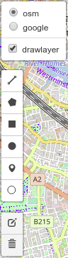
- [x] 测量 `鼠标测量功能`

  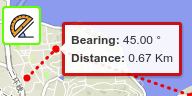
- [ ] 鼠标位置　
- [ ] 比例尺
- [ ] 鹰眼
- [x] 全屏显示 `点击按钮全屏显示`

  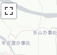
- [x] 文字图标 `使常规的注记上显示对应的文字`

  
> 此脚本允许将字体图标添加进leaflet标记中。与其他标记插件不同的是，不需要任何CSS设置，可以使用任何`bootstrap-style`的图标字体。


- [x] Editable `针对数据的节点进行数据的调节`

  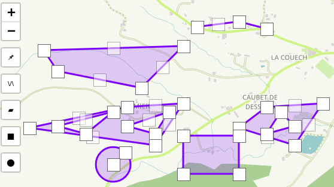
- [ ] Toolbar
- [x] PathDrag `针对图元进行拖动`

  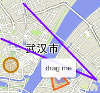  
- [x] Graticule

### 地图标注

> 目前暂无

---
## Geojson
- [x] Point

  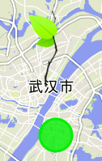

  > 对类型"Point"来说，“coordinates"成员必须是一个单独的位置数组（即`一维数组`）。

  标准数据格式：
```javascript
var Point = {
    "type": "Feature",
    "geometry": {
        "type": "Point",
        "coordinates": [102.0, 0.5]},
    "properties": {
        "prop0": "value0"
    }
}
```

- [x] Line

  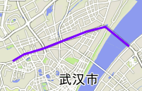

  > 对类型"LineString"来说，“coordinates"成员必须是`两个`或者`多个`位置的数组。

  标准数据格式：
  ```javascript
  var GeoLine = {
          "type": "LineString",
          "properties":{
              "prop0": "value0"
          },
          "coordinates": [
                  [
                      114.34776306152344,
                      30.623436511269382
                  ],
                  [
                      114.32510375976562,
                      30.63909360759635
                  ],
                  [
                      114.30673599243164,
                      30.634958017061198
                  ],
                  [
                      114.29180145263672,
                      30.629640569460406
                  ]]
      };
```

- [x] Polygon

  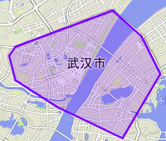

  > 对类型"Polygon"来说，"coordinates"成员必须是一个线性环坐标数组的数组(`三维数组`)。对拥有多个环的的面来说，第一个环必须是外部环，其他的必须是内部环或者孔。

  标准数据格式：
```javascript
var GeoPolygon = {
        "type": "Feature",
        "properties": {},
        "geometry": {
            "type": "Polygon",
            "coordinates": [
                [
                    [
                        114.32510375976562,
                        30.63968439181164
                    ],
                    [
                        114.22931671142578,
                        30.608958829007946
                    ],
                    [
                        114.22348022460937,
                        30.601275914486066
                    ],
                    [
                        114.22931671142578,
                        30.580588116155223
                    ],
                    [
                        114.32510375976562,
                        30.63968439181164
                    ]
                ]
            ]
        }
    };
```

- [x] FeatureCollection

  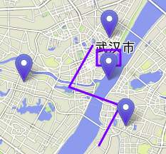

  标准数据格式如下：
  ```javascript
    var FeaCollection = {
         "type": "FeatureCollection",
         "features": [{
           "type": "Feature",
           "geometry": {
             "type": "Point",
             "coordinates": []
           },
         }, {
           "type": "Feature",
           "geometry": {
             "type": "LineString",
             "coordinates": [[]]
           }
         }, {
           "type": "Feature",
           "geometry": {
             "type": "Polygon",
             "coordinates": [[[]]]
           }
         }]
       }
```


---
## 可视化

- [x] 热力图

  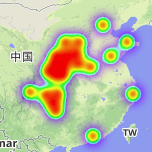

  > 这个是`官方插件`,应该没什么大问题.一个小巧轻便的热力图Leaflet插件 [Leaflet plugin](http://leafletjs.com) .该插件是从 [simpleheat 插件](https://github.com/mourner/simpleheat) 演化而来.

- [x] 聚类图

  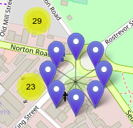

  > * **showCoverageOnHover**: 标移到聚类图标时显示聚类边界范围
  > * **zoomToBoundsOnClick**: 点击聚类图标时是否展开到这级的聚类详情状态
  > * **spiderfyOnMaxZoom**: 当点击一个聚类图标如数量为5,并且该级别没有聚类效果了,则将这5个图标直接像蜘蛛网一样展开显示 (*注意: 除此之外, `disableClusteringAtZoom` 选项为true时,也会触发对应的效果*)
  > * **removeOutsideVisibleBounds**: 当聚类图标或者注记图标离当前的视图太远的时候就不显示,移出对应的图标,这样可以提升显示的性能.
  > * **animate**: 平滑过渡动画. 当 `L.DomUtil.TRANSITION` 为false, 这个属性即使是true也无效
- [x] 蚂蚁线

  

  > AntPath 继承自[FeatureGroup](http://leafletjs.com/reference.html#featuregroup)并且实现了[Path](http://leafletjs.com/reference.html#path)接口


  | name | type | example | description |
  |------|------|---------| ------------|
  |latlngs| L.LatLng[] **or** Array\[number, number\]  | \[ \[0, 10\], \[-20, 0\], ... \] |经纬度数组 (用法与 [Polyline constructor](http://leafletjs.com/reference.html#polyline)一致 )
  |options| Object  | {color: 'red', weight: 5, ...}  |[Polyline options](http://leafletjs.com/reference.html#polyline-options) 加上下面 **extra** options
  |options.paused| boolean | true/false | 暂停(default: false)
  |options.reverse| boolean | true/false | 流动方向
  |options.pulseColor| string | #FF00FF |  dashed flux颜色 (default: 'white')
  |options.delay | string | 120 | 流动速度 (default: 400)
  |options.dashArray| [number, number] **or** string | [15, 30] |虚实线长度 (default: "10, 20").[参考文档](https://developer.mozilla.org/en-US/docs/Web/SVG/Attribute/stroke-dasharray)
- [x] 轨迹图

  

  > 一个可以播放标注动画的leaflet插件,如自行车沿着行驶道路的行车轨迹等[官方示例](http://openplans.github.com/Leaflet.AnimatedMarker/).

  > 使用CSS3的动画原理,让leaflet的marker能够在点与点之间按照指定的速度移动(米/毫秒).

  > 老浏览器兼容性问题-如果是不支持CSS3的浏览器,原理是将整个轨迹切分成`distance`大小的多个线段,然后按照每`interval`秒的时间不断移动来实现,该方式性能不好,`技术是进步的,请使用现代浏览器`.
- [x] 迁移图

  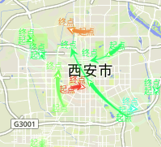

  ```js
var data = [
  {
    "from": [point_iter[0][1], point_iter[0][0]], //本例中经纬度是反过来的[lon, lat]
    "to": [point_iter[last][1], point_iter[last][0]], //leaflet标准是[lat, lon]
    "labels": ["起点", "终点"],
    "color": "#ff3a31"
  }
];
var migrationLayer = new L.migrationLayer({
    map: map,
    data: data
})
```    

---
## 空间分析－客户端

- [x] 泰森多边形

  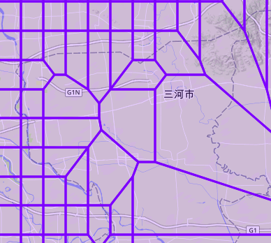

  > 针对给定的点生成泰森多边形,请注意一定要传入bbox参数,`如果没有绘制对应的多边形,那么肯定是bbox的范围没有包含住所有的点集`,*这点非常重要*
- [x] Tin三角网

  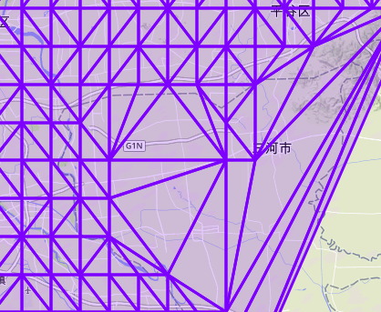
  > TIN方法将无重复点的散乱数据点集按某种规则(如Delaunay 规则) 进行三角剖分，使这些散乱点形成连续但不重叠的不规则三角面片网，并以此来描述3D 物体的表面。
- [x] 缓冲区分析

  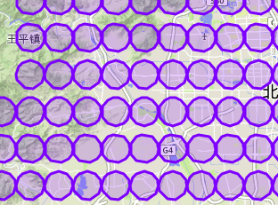
  > 给定一个缓冲半径进行缓冲区分析. 单位支持 `miles 米`,`kilometers 千米`,`degrees 度`.
- [x] 中点点分析

  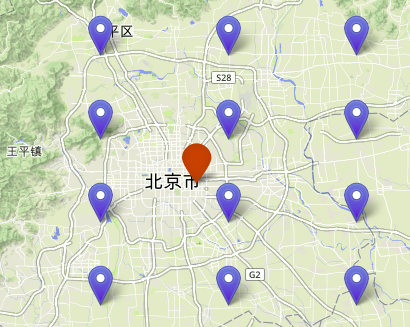
  >计算给定GeoJSON的数据中心支持所有的GeoJSON类型
- [x] 线型插值

  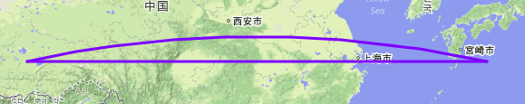
  > 线插值操作是通过 `计算起点-终点长度`,然后再根据长度等分计算需要插值的点,最后再把这些点插入到原始数据中.

---
## ElasticSearch
- [x] 地理围栏

  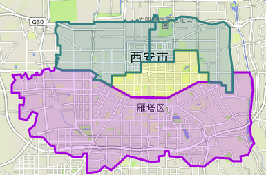

  这里的代码的主要逻辑如下:

  **1.初始化操作**

      1.1 initMap 初始化地图

      1.2 initGeoFencePolygon 该函数主要获取用于网络请求的参数,传入的围栏的范围

      1.3 initGeoFence 地图显示地理围栏范围,更具不同的属性设置不同的颜色

      1.4 initTrackView 初始化地图中动态设备点的样式,如在围栏内蓝色,不在使用红色等

  **2. 获取设备 异步操作**

      2.1 initCarIds 获取要监控的设备id列表

  **3. 实时查询 异步操作**

      3.1 loadRealData 根据1.2获取的围栏范围以及2获取的设备列表来请求数据信息

      3.2 updateTrackView  根据上面请求的数据实时更新地图上的设备状态
