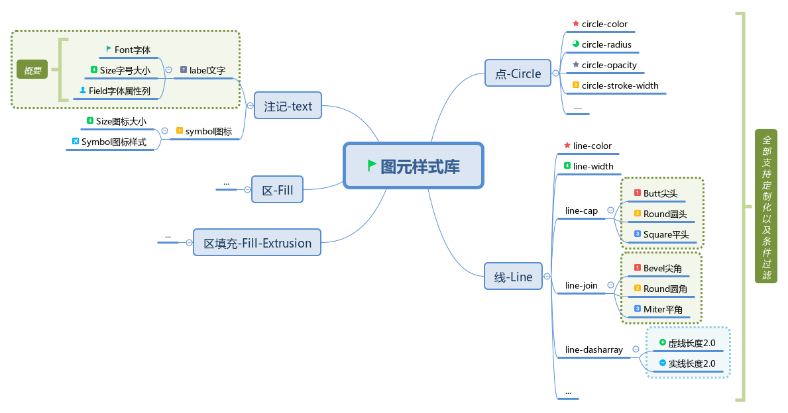
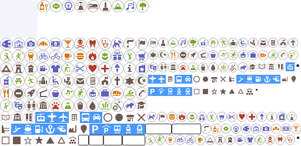
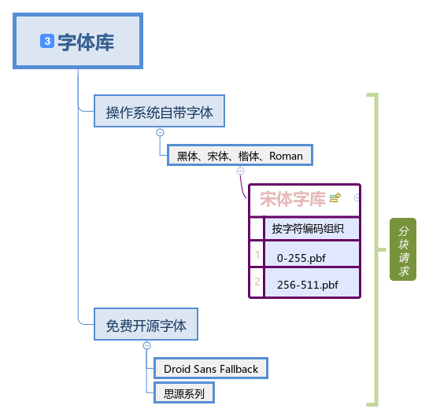

## 官方示例

---
##### MapBox Key
!> pk.eyJ1IjoicGFybmRlZWRsaXQiLCJhIjoiY2o1MjBtYTRuMDhpaTMzbXhpdjd3YzhjdCJ9.sCoubaHF9-nhGTA-sgz0sA

*这是潘卓然私人的key,请在下面的网页注册一个自己的key*

**mapbox底图Token获取网址：**
> [mapbox密钥获取](https://www.mapbox.com/account/access-tokens)

**流量计费**
> [密钥收费标准说明](https://www.mapbox.com/pricing/)

---
#### Bug

!> 由于该地图是以https的方式提供的，如果是通过公司的CProxy代理，一般大部分请求都无法转发，请注意这一点。

---


## 样式库
> 这个可能是最不好理解的部分，因为和我们中地数码的系统库`完全是两种模式`，因此如果带着`中地系统库的思维方式`理解是很难理解的。



---
#### 提交BUG
!> 找到bug请提交,我们会及时解决[issue](https://github.com/ParnDeedlit/WebClient-Mapbox/issues)

---
#### 基本介绍
**我只介绍拥有svg策略的样式， 勉强对应中地数码的符号库**

|拥有的表达样式|说明|
|:---|:---|
|**线数据类型**||
|circle样式|这里的意思是线数据可以使用点的样式表示，显示结果是线上零星的圆点|
|line样式|线使用本身的样式，显示结果可以是沟线，实虚线，虚化线等等|
|symbol样式|线使用注记的样式，其实是针对线进行对应的标记标注，如道路的注记标注，这里请仔细参考`基本样式-注记`一节，symbol样式分为图片和文字两部分|
|**区数据类型**||
|circle样式|这里的意思是区数据可以使用点的样式表示，显示结果是线上零星的圆点|
|line样式|区使用本身的样式，显示结果可以是区的边界线，如：沟线，实虚线，虚化线等|
|fill样式|区使用本身的样式，显示结果可以是各种颜色的填充，svg图片的填充等|
|fill-extrusion样式|区使用带高度的情况，显示结果可以是各种颜色的建筑表面，svg图片的填充表面等，这个样式是有`高程信息`的。|
|symbol样式|区使用注记的样式，其实是针对线进行对应的标记标注，如道路的注记标注，这里请仔细参考`基本样式-注记`一节，symbol样式分为图片和文字两部分|

> 针对上述使用svg的样式，其主要的属性是：line的`line-pattern`, fill的`fill-pattern`, fill-extrusion的`fill-extrusion-pattern`, symbol的`icon-image`等都是对应的svg图标的名字。，那么问题来了，`如何获得对应的图标呢`

---
#### 图标获取 Sprite库


**基本导入**

``` javascript
var map = new mapboxgl.Map({
  style: {
    "version": 8,
    //特别注意，这里是字体库，下面的sprite才是样式库
    "glyphs": "http://192.168.10.185:6163/igs/rest/mrms/vtiles/fonts/{fontstack}/{range}.pbf",
    //特别注意，这里是真正的图片样式库
    "sprite": "http://192.168.10.185:6163/igs/rest/mrms/vtiles/sprite",
  },
});
```

**样式库图片**




[官方样式png](https://api.mapbox.com/styles/v1/mapbox/streets-v8/sprite.png?access_token=pk.eyJ1IjoicGFybmRlZWRsaXQiLCJhIjoiY2o1MjBtYTRuMDhpaTMzbXhpdjd3YzhjdCJ9.sCoubaHF9-nhGTA-sgz0sA)以及[官方样式json](https://api.mapbox.com/styles/v1/mapbox/streets-v8/sprite.json?access_token=pk.eyJ1IjoicGFybmRlZWRsaXQiLCJhIjoiY2o1MjBtYTRuMDhpaTMzbXhpdjd3YzhjdCJ9.sCoubaHF9-nhGTA-sgz0sA)

> Sprite 样式库将将所有的符号排列在一张图片上，然后更具每个字符`star-24`的映射找到对应的符号在整个图片的起始位置和宽高

~~~ json
"star-24": {
  "height": 24, //高为24
  "pixelRatio": 1,//像素角度，使效果先对圆润
  "width": 24,  //宽为24
  "x": 360,//在大图中的水平位置是360
  "y": 96 //在大图中的竖直位置是96
}，{

}
...
~~~

> 根据上面的信息，最终得到的图片就是：


[官方样式库地址](https://api.mapbox.com/styles/v1/mapbox/bright-v8/sprite.json?access_token=pk.eyJ1IjoicGFybmRlZWRsaXQiLCJhIjoiY2o1MjBtYTRuMDhpaTMzbXhpdjd3YzhjdCJ9.sCoubaHF9-nhGTA-sgz0sA)

~~~ json
{
    airport-15: {
      width: 17,
      height: 17,
      x: 45,
      y: 37,
      pixelRatio: 1,
      visible: true
    }
    alcohol-shop-11: {
      width: 13,
      height: 13,
      x: 204,
      y: 124,
      pixelRatio: 1,
      visible: true
    }
    alcohol-shop-15: {
      width: 17,
      height: 17,
      x: 50,
      y: 55,
      pixelRatio: 1,
      visible: true
    }
}
~~~

---
#### 自己生成样式库
请参考[Sprite样式库](https://www.mapbox.com/mapbox-gl-js/style-spec#sprite)和[生成工具](https://github.com/mapbox/spritezero-cli)

---

## 字体库



**基本导入**

``` javascript
var map = new mapboxgl.Map({
  style: {
    "version": 8,
    //特别注意，这里是字体库,字体库往往和下面的样式库一起使用
    "glyphs": "http://192.168.10.185:6163/igs/rest/mrms/vtiles/fonts/{fontstack}/{range}.pbf",
    //特别注意，这里是真正的图片样式库
    "sprite": "http://192.168.10.185:6163/igs/rest/mrms/vtiles/sprite"
  },
});
```

> 这个理解起来很简单，就是将各个字体的`字符集合`生成很多`碎片文件`(pbf文件)，如0-255.pbf, 256-511.pbf...3840-4095.pbf等。假设：字符“中”字的序列号是450，这请求256-512.pbf这个文件即可获取对应的"中"字了.

> `{fontstack}`表示什么字体:宋体,黑体... `{range}`表示你使用的字符在很多碎片文件中的位置序号.

``` html
//如使用了"中"字,并且使用的是"黑体",假设"中"字是第450个,450 在256~511之间.则发出请求
http://localhost:8822/vectortile/glyphs/黑体/256-511.pbf
```
