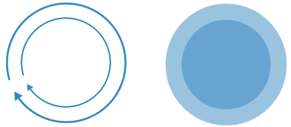
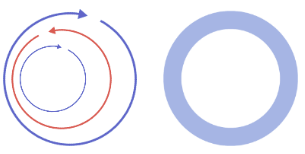

## 前端性能与效率

> 前端才是矢量瓦片的全部重心,其测试重要性`远远胜于`后台的数据生成.很多问题都是前端的`瓶颈`导致的.下面花费这么多的篇幅讲解前端性能的目的是让用户与开发者明白,矢量瓦片的`核心技术是前端渲染`.

### 性能

!> 以常见的电脑配置 ThinkPad X250为例作为测试用例,从瓦片的传输速度和大小以及绘制卡顿情况分析对应的前端性能

|设备|类型|数值|
|:---|:---|:---|
|CPU | intel i5 5300U|2.3G Hz|
|内存|金士顿 DDR3L（低电压版）1600MHz|8G|
|显卡   |核心显卡 Intel GMA HD 5500  |900mhz, 24个EU,一句话`低端显卡`|

---
#### 瓦片大小
> 瓦片大小影响的是传输速度与解码速度,以内网100M和外网2M的网速举例

下面是地类图斑的两张有代表性的瓦片大小

|瓦片行列号|shapefile|geojson|pbf|
|:---|:---|:---|:---|
|6-54-24 |3.5 MB| 4.6 MB |370.8 KB |
|压缩率|100%|131.42%|10.345%|
|6-54-25 |6.2MB| 8.3 MB |660 KB |
|压缩率|100%|133.87%|10.395%|

> 上面的数据表明矢量瓦片的体积相比以往的传统的矢量格式是做到`10~15%的压缩比`,压缩率很高

!> 插句题外话,由于矢量瓦片可以携带属性数据,如果某些图元的属性列有200多列的话,并且是中文(占2字节),其体积大小可想而知.......

---
### 绘制帧率

!> 下面的表格是一个笼统的表格: 由于每台机器的显卡性能各不一样,只能是参考意义:

|绘制引擎|每张瓦片图元数量|拖动流畅度|渲染速度|
|:---|:---|:---|:---|
|MapBox GL|40000|一般|一般|
|MapBox GL|20000|`流畅`|`流畅`|
|Leaflet|40000|卡顿|一般|
|Leaflet|20000|一般|流畅|
|OpenLayers3|40000|卡顿|动不了|
|OpenLayers3|20000|卡顿|超慢|

> 结论,webgl硬件加速支持的`MapBox明显是矢量瓦片的最优选择`.

---
### 绘制内存

> 针对地类图斑等密集的区数据,每张瓦片的大小是3-5M之间,几乎每张瓦片的数据量到了30000-50000点左右

|绘制引擎|是否内存优化策略|内存极限|
|:---|:---|:---|
|MapBox GL  | 有 | 理论上无限 |
|Leaflet  | 有 | 如果快速滑动的话,则是在1.2G左右浏览器崩溃,8G内存机器 |
|OpenLayer-直接绘制模式  | 无 | 几乎动不了,无法绘制 |
|OpenLayer-混合绘制模式  | 有,实际上有但是没点用 | 最优绘制,线和区生成图片,实时绘制点图元 |
|OpenLayer-图片绘制模式  | 有,实测无效... | 相对一般绘制,所有图元前端生成图片,图元数过多会卡顿 |

!> 无论OpenLayer是那种模式,在大数据量下,都会崩溃.`几乎无解`..........

---
### 绘制方式与颜色

> 1. MapBox GL是直接绘制矢量图元,颜色是高保真的支持`#ff0`，`#ffff00`,`rgb(255, 255, 0)`,`rgba(255, 255, 0, 1)`,`hsl(100, 50%, 50%)`,`hsla(100, 50%, 50%, 1)`,`yellow`颜色模式,支持`无级缩放`

> 2. Leaflet是前端生成图片进行组合,颜色支持8/16位色彩,只能`按级缩放`

> 3. OpenLayers,3种模式:,只能`按级缩放`

> > 直接绘制模式-一坨屎一样的东西,简直是恶心人,不管是下面的区的方向和速度都是垃圾中的垃圾,谁用谁SB

> > 混合绘制模式-官方默认的模式,线和区生成图片,点直接绘制,相对合理,就是颜色显示不太正确,相同的颜色显示色彩偏暗.缺点:瓦片与瓦片之间如果存在注记`重复`的话`不会避让`,甚至是左边绘一半,右边绘一半的尴尬场面.....

> > 图片绘制模式-点线区都生成图片进行绘制,这个其实和上面的区别不大,就是不会出现上面的点图层的分割现象.

!> OpenLayer官方压根就是不想支持矢量瓦片的,其内部对其代码的维护也停止了,千万不要强行使用OpenLayer加载矢量瓦片,否则进坑几乎无法跳出来.....

---
### 绘制效果

!> 特别注意,同一份矢量瓦片数据在不同的地图前端引擎的绘制效果是不一致的.

原因如下, 我们中地数码的数据模型是自己定义的,MapBox严格`准守ogc标准`,Leaflet`相对严格`,OpenLayers也是部分ogc标准(与我们类似).以多次测试中经常出现的带洞区为例.

|绘制引擎|MapBox|Leaflet|OpenLayer|中地数码|
|:---|:---|:---|:---|
|带洞区-外圈顺时针,内圈逆时针 |||||
|带洞区-外圈顺时针,内圈顺时针 |||||
|多带洞区-外圈顺时针,内圈顺时针,内内全顺时针|||||

!> MapBox的标准定义,也是OGC的官方标准, 我们`中地数码`的规则是`内圈永远是空心`的区.

### 浏览器支持

|浏览器|IE | Edge|Chrome|Firefox|Opera|Safari|
|:---|:---|:---|:---|:---|:---|:---|
| MapBox GL  | 不支持 |  不支持 |  23.0+ |38.0+   |20.0+   |12+|
| Leaflet  | 7-11(0.7支持7 ,1.3支持) IE9+ |  支持 |  26.0+ |23.0+   |12.0+   |5+|
| OpenLayers3  | 10+ |  支持 |  26.0+ |23.0+   |20.0+   |5+|

## 前端BUG

## 后台性能与效率

### 瓦片体积
!> 由于矢量瓦片可以携带/不携带属性字段,因此下面的测试都是不携带属性字段的测试,为了屏蔽属性字段的干扰.

> 一般一张矢量瓦片的体积中,矢量与属性的比重是2:8左右,绝大部分体积都是被属性字段撑大的.

#### 整体瓦片体积

#### 单张瓦片体积

### 速度对比

## 后台BUG

> 暂无发现
