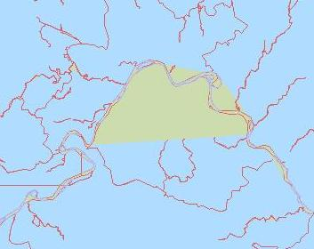
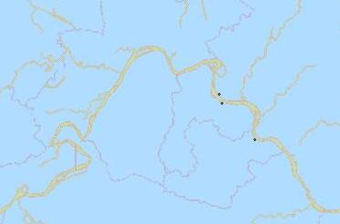

## 前端性能与效率

> 前端才是矢量瓦片的全部重心,其测试重要性`远远胜于`后台的数据生成.很多问题都是前端的`瓶颈`导致的.下面花费这么多的篇幅讲解前端性能的目的是让用户与开发者明白,矢量瓦片的`核心技术是前端渲染`.

### 性能

!> 以常见的电脑配置 ThinkPad X250为例作为测试用例,从瓦片的传输速度和大小以及绘制卡顿情况分析对应的前端性能

|设备|类型|数值|
|:---|:---|:---|
|CPU | intel i5 5300U|2.3G Hz|
|内存|金士顿 DDR3L（低电压版）1600MHz|8G|
|显卡   |核心显卡 Intel GMA HD 5500  |900mhz, 24个EU,一句话`低端显卡`|

---
#### 瓦片大小
> 瓦片大小影响的是传输速度与解码速度,以内网100M和外网2M的网速举例

下面是地类图斑的两张有代表性的瓦片大小

|瓦片行列号|shapefile|geojson|pbf|
|:---|:---|:---|:---|
|6-54-24 |3.5 MB| 4.6 MB |370.8 KB |
|压缩率|100%|131.42%|10.345%|
|6-54-25 |6.2MB| 8.3 MB |660 KB |
|压缩率|100%|133.87%|10.395%|

> 上面的数据表明矢量瓦片的体积相比以往的传统的矢量格式是做到`10~15%的压缩比`,压缩率很高

!> 插句题外话,由于矢量瓦片可以携带属性数据,如果某些图元的属性列有200多列的话,并且是中文(占2字节),其体积大小可想而知.......

---
### 绘制帧率

!> 下面的表格是一个笼统的表格: 由于每台机器的显卡性能各不一样,只能是参考意义:

|绘制引擎|每张瓦片图元数量|拖动流畅度|渲染速度|
|:---|:---|:---|:---|
|MapBox GL|40000|一般|一般|
|MapBox GL|20000|`流畅`|`流畅`|
|Leaflet|40000|卡顿|一般|
|Leaflet|20000|一般|流畅|
|OpenLayers3|40000|卡顿|动不了|
|OpenLayers3|20000|卡顿|超慢|

> 结论,webgl硬件加速支持的`MapBox明显是矢量瓦片的最优选择`.

---
### 绘制内存

> 针对地类图斑等密集的区数据,每张瓦片的大小是3-5M之间,几乎每张瓦片的数据量到了30000-50000点左右

|绘制引擎|是否内存优化策略|内存极限|
|:---|:---|:---|
|MapBox GL  | 有 | 理论上无限 |
|Leaflet  | 有 | 如果快速滑动的话,则是在1.2G左右浏览器崩溃,8G内存机器 |
|OpenLayer-直接绘制模式  | 无 | 几乎动不了,无法绘制 |
|OpenLayer-混合绘制模式  | 有,实际上有但是没点用 | 最优绘制,线和区生成图片,实时绘制点图元 |
|OpenLayer-图片绘制模式  | 有,实测无效... | 相对一般绘制,所有图元前端生成图片,图元数过多会卡顿 |

!> 无论OpenLayer是那种模式,在大数据量下,都会崩溃.`几乎无解`..........

---
### 绘制方式与颜色

> 1. MapBox GL是直接绘制矢量图元,颜色是高保真的支持`#ff0`，`#ffff00`,`rgb(255, 255, 0)`,`rgba(255, 255, 0, 1)`,`hsl(100, 50%, 50%)`,`hsla(100, 50%, 50%, 1)`,`yellow`颜色模式,支持`无级缩放`

> 2. Leaflet是前端生成图片进行组合,颜色支持8/16位色彩,只能`按级缩放`

> 3. OpenLayers,3种模式:,只能`按级缩放`

> > 直接绘制模式-一坨屎一样的东西,简直是恶心人,不管是下面的区的方向和速度都是垃圾中的垃圾,谁用谁SB

> > 混合绘制模式-官方默认的模式,线和区生成图片,点直接绘制,相对合理,就是颜色显示不太正确,相同的颜色显示色彩偏暗.缺点:瓦片与瓦片之间如果存在注记`重复`的话`不会避让`,甚至是左边绘一半,右边绘一半的尴尬场面.....

> > 图片绘制模式-点线区都生成图片进行绘制,这个其实和上面的区别不大,就是不会出现上面的点图层的分割现象.

!> OpenLayer官方压根就是不想支持矢量瓦片的,其内部对其代码的维护也停止了,千万不要强行使用OpenLayer加载矢量瓦片,否则进坑几乎无法跳出来.....

---
### 绘制效果

!> 特别注意,同一份矢量瓦片数据在不同的地图前端引擎的绘制效果是不一致的.

原因如下, 我们中地数码的数据模型是自己定义的,MapBox严格`准守ogc标准`,Leaflet`相对严格`,OpenLayers也是部分ogc标准(与我们类似).以多次测试中经常出现的带洞区为例.

|绘制引擎|MapBox|Leaflet|OpenLayer|中地数码|
|:---|:---|:---|:---|
|带洞区-外圈顺时针,内圈逆时针 |||||
|带洞区-外圈顺时针,内圈顺时针 |||||
|多带洞区-外圈顺时针,内圈顺时针,内内全顺时针|||||

!> MapBox的标准定义,也是OGC的官方标准, 我们`中地数码`的规则是`内圈永远是空心`的区.

*示例说明*，左边是`mapbox`, 右边是`openlayers`

 

### 浏览器支持

|浏览器|IE | Edge|Chrome|Firefox|Opera|Safari|
|:---|:---|:---|:---|:---|:---|:---|
| MapBox GL  | 不支持 |  不支持 |  23.0+ |38.0+   |20.0+   |12+|
| Leaflet  | 7-11(0.7支持7 ,1.3支持) IE9+ |  支持 |  26.0+ |23.0+   |12.0+   |5+|
| OpenLayers3  | 10+ |  支持 |  26.0+ |23.0+   |20.0+   |5+|

## 前端BUG

!> 如果遇见新的BUG，请到[中地数码官方BUG下提交]()

|序号|说明|是否解决|
|:---|:---|:---|
|1|设置点、线、填充图层样式时，都有一个透明度的参数，建议去掉。因为在设置颜色时，有透明度的参数，与此处重复|这个其实是应用场景的不同，如果只是颜色的确可以去掉，但是针对图片的透明度就不能这样了|
|2|点图层样式中有两个透明度，建议区分，一个是填充透明度，一个是外边界线透明度|已解决|
|3|在设置颜色时候可以设置透明度，但颜色面板中透明度是0-100，但是在参数的对话框中透明度值为0-1，建议统一|已解决|
|4|在编辑器中，修改图层名称 "id"，不能成功，但是在功能界面中可以成功|尚未解决|
|5|无法修改图层类型，如将点改为注记。如果不能修改，请将界面下拉框灰掉|尚未解决|
|6|有实虚线设置时，设置线填充图案不起作用|`这个是矢量瓦片的规范，后面使用的时候按照这个规范使用`|
|7|点节距模式、线头、线拐角等能否用下拉框方式，切换按钮的方式太不明显了，都不知道选择的是哪一个|已解决|
|8|注记调整图层参数后，不会及时刷新显示|尚未解决|
|9|道路线动态注记，不勾选“是否保持垂直”时，注记会重复，好不清楚|尚未解决|
|10|符号光环不起作用，设置了没有效果|`这个必须和符号宽度一起使用，光环宽度应该小于等于符号宽度`|
|11|区参数设置时，勾选抗锯齿，结果显示区边界，不勾选则不显示区边界。这个效果不对，抗锯齿应该是平滑显示才对。|尚未解决|
|12|在前端设置矢量瓦片样式时，应该有保存和另存两个功能，保存后修改样式后下次打开是修改后的样式；另存是将修改后的样式保存为xml文件。|由于前端是无状态设置，是不保存之前的操作的，都通过json的方式实现本地保存|
|13|图层属性过滤时，建议可以通过下拉框选择属性字段，需要用户手动输入比较麻烦，容易输入错误|尚未解决|

## 后台性能与效率

### 瓦片体积
!> 由于矢量瓦片可以携带/不携带属性字段,因此下面的测试都是不携带属性字段的测试,为了屏蔽属性字段的干扰.

> 一般一张矢量瓦片的体积中,矢量与属性的比重是2:8左右,绝大部分体积都是被属性字段撑大的.

#### 整体瓦片体积
!> 由于不同的数据的属性字段各不相同，因此下面的体积是没有什么意义的，仅做参考，目的只是为了说明矢量瓦片的体积要小很多。

> 20w中国的1-13级的`矢量瓦片`的整体大小是201M， 而`栅格瓦片`在第10级就到达了1G左右。。。。

#### 单张瓦片体积

!> 由于不同的数据的属性字段/几何形态各不相同，因此下面的体积是没有什么意义的，仅做参考，目的只是为了说明矢量瓦片的体积要小很多。

|级别|平均大小|该级别瓦片张数|
|:---|:---|:---|
|1|1.69M|1|
|2|471Kb|4|
|3|256Kb|8|
|4|144Kb|17|
|5|61Kb|47|
|6|40Kb|155|
|7|20Kb|559|
|8|2 Kb|2117|
|9|800字节|8208|
|10|250字节|366|

### 速度对比

#### 大范围-低密度数据量测试

   > 数据信息

   |说明|点要素数量|线要素数量|区要素数量|
   |:---|:---|:---|:---|
   |25w中国地形图|63万|90万|8万|

   > 时间信息

   |线程数|总计时间|构建索引时间|数据预处理时间|瓦片裁剪0～9|瓦片裁剪10|瓦片裁剪11|瓦片裁剪12|
   |:---|:---|:---|:---|:---|:---|:---|:---|
   |栅格瓦片||||||||
   |无线程概念|`7小时14分23秒`|无|无|2分23秒|9分36秒|54分15秒|5小时48分23秒|
   |全裁图模式||||||||
   |4线程|`5小时52分34秒`|25秒|4分11秒|3分02秒|8分26秒|48分12秒|4小时48分23秒|
   |8线程|`5小时1分3秒`|23秒|4分16秒|2分45秒|7分16秒|43分08秒|3小时53分16秒|
   |智能裁图模式||||||||
   |4线程|`7分08秒`|28秒|4分14秒|1分30秒|36秒|18秒|2秒|
   |8线程|`6分58秒`|24秒|4分14秒|1分24秒|34秒|16秒|2秒|

#### 小范围-高密度数据量测试

   > 数据信息

   |说明|点要素数量|线要素数量|区要素数量|
   |:---|:---|:---|:---|
   |测试数据|无|10万|89万|

   > 时间信息

   |线程数|总计时间|构建索引时间|数据预处理时间|瓦片裁剪0～15|
   |:---|:---|:---|:---|:---|
   |全裁图模式|||||
   |4线程|`20分58秒`|38秒|1分25秒|19分05秒|
   |8线程|`18分43秒`|36秒|1分23秒|18分07秒|
   |智能裁图模式|||||
   |4线程|`12分59秒`|43秒|1分23秒|10分53秒|
   |8线程|`11分52秒`|43秒|1分26秒|9分43秒|

#### 流体类异常数据量测试

   > 数据信息

   |说明|点要素数量|线要素数量|区要素数量|
   |:---|:---|:---|:---|
   |测试数据|无|无|46万|

   > 数据破损情况

   + 阈值设置为1的时候`没有破损`，但是瓦片的体积却达到了`2-4M`
   + 阈值设置为2的时候`轻微破损`，瓦片的体积却达到了1-3M
   + 阈值设置为4的时候`明显破损`，瓦片的体积却达到了`1M以下`，但是在8-10级的时候呈现的效果却是`很多镂空`。

## 后台BUG

|序号|说明|是否解决|
|:---|:---|:---|
|1|当选择全裁图模式时，如果输出是VTDF格式，如果最大级别大于实际级别的话，会停在等待界面|已修复，重新判断真正的最大级别|
|2|模板中，省级模板和地类图斑模板没有默认图片|已修复，补充了默认图片|
