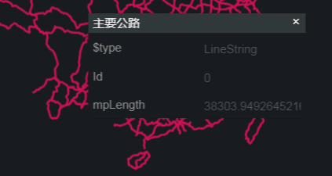
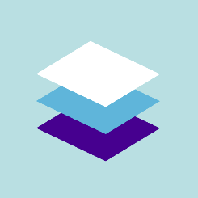
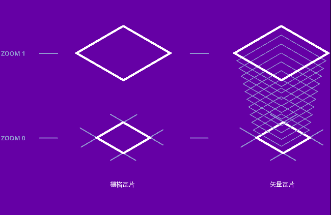
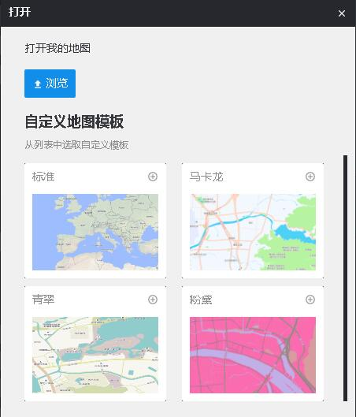
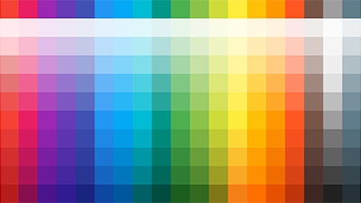
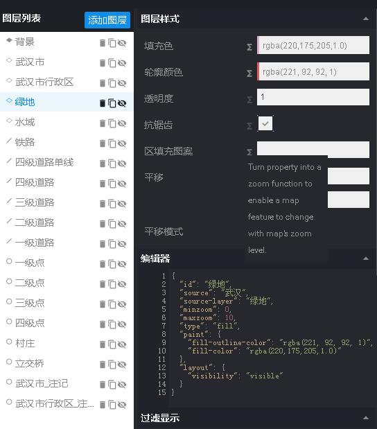

# 矢量瓦片

> 中地数码的矢量瓦片统一格式为mapbox vector tile( ** MVT ** 格式)
>> 中地数码的矢量瓦片单张矢量瓦片的后缀是 ** .pbf **

!> 最能发挥矢量瓦片效率的前端引擎是 **mapbox gl**

## 产生原因

> 随着大数据技术的发展，人们对电子地图的快速共享需求也越来越强烈。传统电子地图共享时，通常会通过瓦片裁剪工具获取栅格瓦片。相对于其他技术，栅格瓦片底图有其优越性，例如有效减少了传输数据体积，多级缩放等。然而，栅格瓦片底图也有一些短处，缺乏灵活性、实时性，数据完整性受损是比较突出的问题，这正是栅格数据的问题：

+ `缺乏灵活性`。栅格瓦片完成后，已经保存为图片格式，样式不可修改。若要多种栅格底图，需裁剪多分栅格瓦片底图；
+ `缺乏实时性`。由于栅格瓦片已保存为图片格式，当现实世界地物有变化时，不能实时更新，只能重新裁剪栅格瓦片；
+ `丢失属性信息`。栅格瓦片没有属性信息，若要查询图片的多边形的属性，需要到服务器重新请求。

## 优点

> 基于栅格瓦片底图的劣势，MapGIS 可支持矢量瓦片底图。矢量瓦片针对矢量电子地图，按照一定的标准和技术将其保存为多种比例尺的矢量分块数据，在前端显示电子地图时，可直接调用矢量分块进行绘制。

`MapGIS矢量瓦片具有如下优势：`

+ 可保留属性信息，在客户端进行查询时，无需再次请求服务器；

  
+ 采用分块编码模式，客户端获取时只返回请求区域和相应级别的矢量瓦片底图，且采用实时绘制矢量模式，绘制效率更高；

  
+ 矢量瓦片分辨率高达4096*4096，是栅格瓦片的16倍，可保证缩放过程中的细节高度还原，且满足高分屏绘制需求；

  
+ 样式可以改变和定制，矢量切片可以在客户端渲染，可以按照用户赋予的样式渲染。如导航地图有白天和黑夜两种模式，只需共用一份矢量瓦片底图，利用两套样式进行渲染即可；

  
+ 客户端显示矢量瓦片底图时，可以通过属性过滤条件可以任意过滤筛选图元，实现个性化定制；

  
+ 客户端显示矢量瓦片底图时，可以编辑底图中每一个矢量图层的可见状态，调整矢量层的叠加压盖顺序，修改矢量图层的颜色、大小等显示样式。

  

## 缺点

!> 别看矢量瓦片有着这么多优秀的特性,但矢量有矢量的优势,瓦片有瓦片的优势,矢量瓦片的极限与应用场景也是存在的.矢量瓦片的极限在于webgl的绘制极限与阈值抽稀的问题.webgl的绘制极限决定了矢量瓦片同时显示绘制的图元数量有上限,这要么是在裁图的时候设置可见显示比控制图元数量,要么是前端显示的时候控制可见显示比.这个问题相对容易解决.

> 其主要矛盾​ 是 `矢量瓦片是专门用于电子地图/地形图的技术`.它在解决`人造建筑与地形的切分`上有着**极大**的优势.但是针对地类图斑这种区与区之间存在紧密的拓扑相连的流体的形态时,其劣势尽显.主要体现在以下3点:

1. 体积与形态一致性的矛盾,目前的算法(这也是​ 道格拉斯普克算法​ 的极限)一旦保证整体的形态不出现较大的镂空,其体积必然过大;反之如果要控制保证密集区域的体积,则必然增大阈值,加大抽稀力度,则会产生对应的镂空(前者是MapGIS的策略,保证形态,​ 后者是ArcGIS的策略,做了合并操作,存在镂空).
2. 相邻多边形抽稀产生的缝隙,在一些理想阈值情况下产生了缝隙,原因在于​ 道格拉斯普克算法​ 本身`无法保证相邻区之间的拓扑关系`,​ 说 明白一点,矢量瓦片仅仅是一种​ `前端快速显示`​ 的技术.它是栅格瓦片的改进版,但是也跳不出​ `瓦片技术的极限​` .
3. 目前算法确实没有找到地类图斑这类流体的自适应阈值的规律
